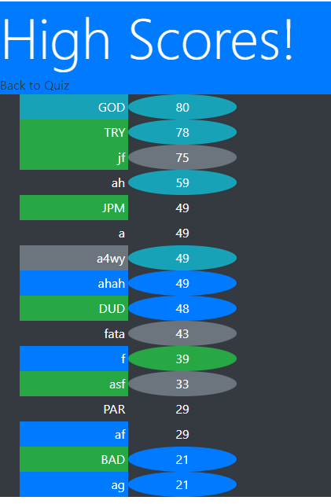

https://morgansplaygames.github.io/parkers-quiz/index.html


# parkers-quiz
A quiz game to help study coding terminology

## User Story

```
AS A coding boot camp student
I WANT to take a timed quiz on JavaScript fundamentals that stores high scores
SO THAT I can gauge my progress compared to my peers
```


## Acceptance Criteria

```
GIVEN I am taking a code quiz
WHEN I click the start button
THEN a timer starts and I am presented with a question
WHEN I answer a question
THEN I am presented with another question
WHEN I answer a question incorrectly
THEN time is subtracted from the clock
WHEN all questions are answered or the timer reaches 0
THEN the game is over
WHEN the game is over
THEN I can save my initials and score
```

## psudocode:

Start Button

Timer

Question Game

General Layout:

Questions need to fit a designated area centered

Answers need to fit in the areas underneath questions in a two by two area

Timer centered above

Score to the top right

Question Generated with one correct answer

Button's for answers

Randomized questions from list

Randomized placement for answers

Scoring System

Penalty system

Score Saving System


    html:
    made base layout for system.
    updated the "answers" id to "choices" .

    JS
    start button done
    timer done
    start button connected to timer done
    choice buttons done
    question/answer embeded array added
    new question upon start with answers attached to choice buttons
    scrambler/shuffler added
    question list scrambled upon iniation
    answers scrambled upon calling a new question with right answer saved.
    score number added correct answer 5 points
    total score is time left + score
    added save button
    save button saves the initials through a prompt
    